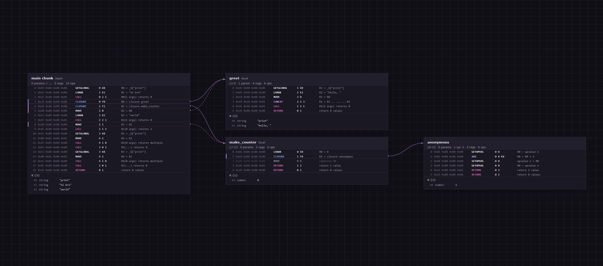

# LuaLens

**Interactive Lua 5.1 bytecode compiler, disassembler, and function graph visualizer.**

Native Windows desktop app built with C++20 and Edge WebView2.



## Features

- Compile Lua 5.1 source → official bytecode
- Full chunk parser (instructions, constants, nested prototypes, locals, upvalues, line info)
- Interactive function graph (pan, zoom, drag nodes, edges between closures)
- Linear disassembly view + hex dump of raw bytes
- Opcode annotations and constant inspection
- File open + sample code included

## Tech Stack

- **C++20** + Win32 + WebView2
- Embedded Lua 5.1.5 (compiler core only)
- Custom binary chunk reader
- Pure header-only modules + embedded web UI
- CMake 3.20+

## Build

Requires:
- CMake 3.20+
- MSVC (C++20)
- WebView2 runtime (comes with Microsoft Edge)

```bash
build.bat
```

or

```bash
cmake -B build -A x64
cmake --build build --config Release
```

Executable: `build/Release/LuaLens.exe`

## Usage

1. Run `LuaLens.exe`
2. Paste Lua 5.1 source (or open a `.lua` file)
3. Press **Ctrl+Enter** or click **Compile & Disassemble**
4. Explore the graph, linear view, or hex dump

## Project Layout

```
LuaLens/
  src/            Native window + WebView2 host
  bytecode/       Chunk layout, reader, compiler wrapper
  server/         JSON + HTTP fallback
  web/            Embedded UI (HTML/CSS/JS)
  third_party/lua51/   Lua 5.1.5 sources
```

## License

MIT.  
Lua 5.1.5 is also MIT (Lua.org, PUC-Rio).
